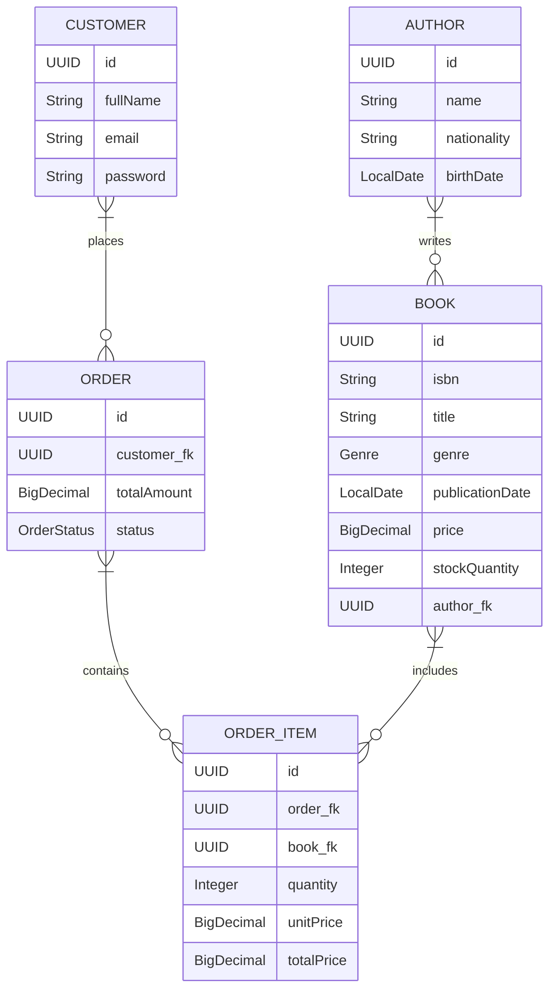

# Bookstore API - Sistema de Gerenciamento de Livraria


## 🚀 Sobre o Projeto

Esta é uma API RESTful robusta para o gerenciamento de uma livraria online, desenvolvida com as tecnologias mais modernas do ecossistema Java e Spring. O projeto foi construído com foco em **Clean Architecture** e **SOLID**, resultando em um código desacoplado, testável e de fácil manutenção.

Este projeto não é apenas um CRUD. Ele foi desenhado para ser uma aplicação de nível profissional, demonstrando práticas de desenvolvimento de software de alta qualidade.

## 🎯 Objetivos do Projeto

*   **Demonstrar Excelência Técnica:** Servir como um exemplo prático de implementação de Clean Architecture, SOLID, e outros padrões de design em um projeto Spring Boot.
*   **Funcionalidades Abrangentes:** Oferecer um conjunto completo de funcionalidades para uma livraria real, desde o gerenciamento de inventário até o processamento de pedidos.
*   **Qualidade de Código:** Manter um alto padrão de qualidade de código, com cobertura de testes, tratamento de exceções e documentação clara.

## 🏛️ Arquitetura e Padrões de Design

A arquitetura deste projeto foi cuidadosamente planejada para garantir escalabilidade, manutenibilidade e testabilidade.

*   **Clean Architecture:** A separação de responsabilidades é rigorosamente seguida, dividindo o projeto em camadas independentes (Domínio, Aplicação, Infraestrutura). Isso permite que o núcleo de negócio da aplicação seja independente de frameworks e tecnologias de banco de dados.
*   **Princípios SOLID:** Cada componente do sistema foi desenvolvido seguindo os cinco princípios SOLID, resultando em um código mais coeso, flexível e robusto.
*   **Domain-Driven Design (DDD):** A modelagem do domínio é o coração da aplicação, com entidades ricas e serviços de domínio que encapsulam as regras de negócio.
*   **Tratamento de Exceções Centralizado:** Um `GlobalExceptionHandler` captura e trata todas as exceções da aplicação, retornando respostas de erro padronizadas para os clientes da API.
*   **DTOs e Mappers:** O padrão Data Transfer Object (DTO) é utilizado para desacoplar as entidades do domínio das representações da API. A biblioteca MapStruct (ou mappers manuais) é usada para conversões eficientes.

### Estrutura de Diretórios

```
src/main/java/io/github/nivaldosilva/bookstore/
├── controllers/      # Endpoints REST, validação de entrada e DTOs
├── services/         # Orquestração e regras de negócio da aplicação
├── entities/         # Entidades do domínio (coração do negócio)
├── repositories/     # Interfaces para acesso a dados (abstração da persistência)
├── mappers/          # Conversores entre Entidades e DTOs
├── config/           # Configurações do Spring (Segurança, Beans, etc.)
└── exceptions/       # Exceções customizadas e handler global
```

## diagrama de entidade e relacionamento



## ✨ Funcionalidades Principais

*   **Gerenciamento de Livros:** CRUD completo, controle de estoque, busca por múltiplos critérios (gênero, autor, etc.), paginação e ordenação.
*   **Gestão de Autores:** Cadastro de autores com informações detalhadas e relacionamento com suas obras.
*   **Sistema de Clientes:** Registro de clientes com autenticação e autorização (a ser implementado com Spring Security).
*   **Processamento de Pedidos:** Criação de pedidos, validação de estoque, cálculo de total e gerenciamento de status do pedido.

## 🛠️ Stack de Tecnologias

*   **Linguagem:** Java 21
*   **Framework:** Spring Boot 3.3.0
*   **Persistência:** Spring Data JPA, Hibernate
*   **Banco de Dados:** MySQL 8.0
*   **Segurança:** Spring Security
*   **Documentação:** SpringDoc OpenAPI (Swagger)
*   **Testes:** JUnit 5, Mockito, AssertJ, Testcontainers
*   **Build:** Maven
*   **Outros:** Lombok

## 🏁 Como Executar o Projeto

### Pré-requisitos

*   JDK 21 ou superior
*   Maven 3.6+
*   MySQL 8.0+
*   Docker (opcional, para usar com Testcontainers)

### Passos

1.  **Clone o repositório:**
    ```bash
    git clone https://github.com/nivaldosilva/bookstore.git
    cd bookstore
    ```

2.  **Configure o banco de dados:**
    *   Crie um banco de dados MySQL chamado `bookstore_db`.
    *   Atualize o arquivo `src/main/resources/application.yml` com suas credenciais do MySQL.

3.  **Execute a aplicação:**
    ```bash
    mvn spring-boot:run
    ```

4.  **Acesse a documentação da API:**
    *   **Swagger UI:** [http://localhost:8080/swagger-ui.html](http://localhost:8080/swagger-ui.html)
    *   **OpenAPI Spec:** [http://localhost:8080/v3/api-docs](http://localhost:8080/v3/api-docs)

## 🤝 Como Contribuir

Contribuições são o que tornam a comunidade de código aberto um lugar incrível para aprender, inspirar e criar. Qualquer contribuição que você fizer será **muito apreciada**.

1.  Faça um "Fork" do projeto
2.  Crie sua Feature Branch (`git checkout -b feature/AmazingFeature`)
3.  Faça o Commit de suas mudanças (`git commit -m 'Add some AmazingFeature'`)
4.  Faça o Push para a Branch (`git push origin feature/AmazingFeature`)
5.  Abra um Pull Request

